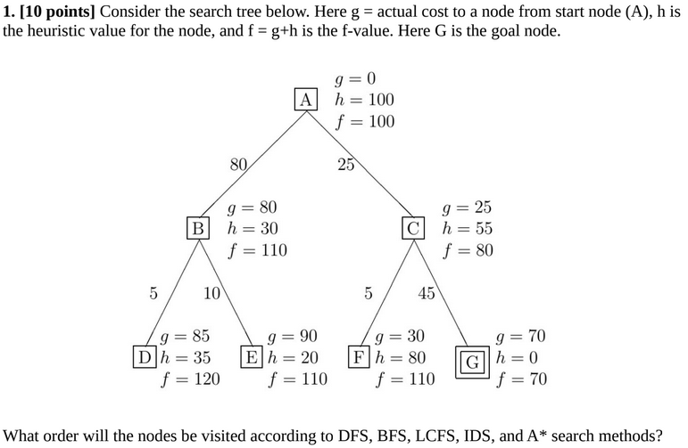
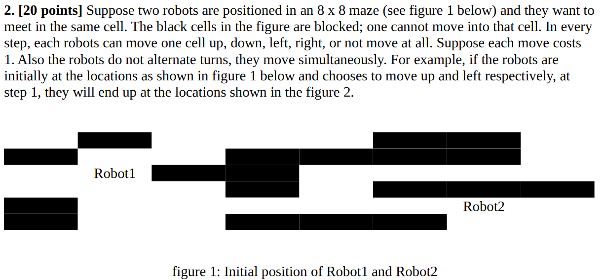
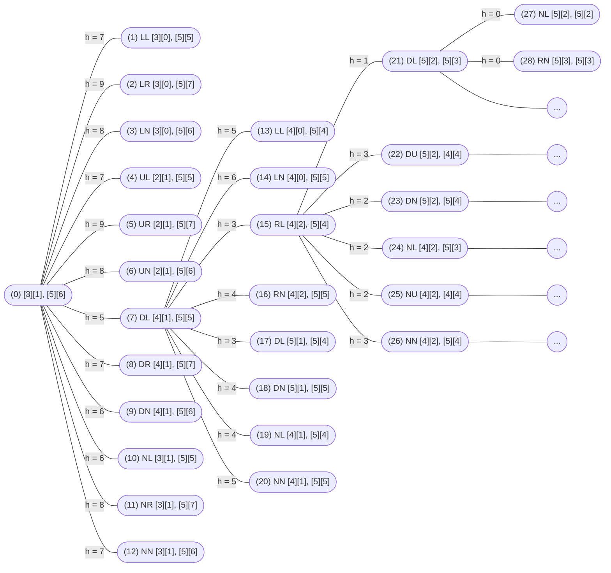

# CSC425 Assignment 2
## Mir Shafayat Ahmed 1910456

# Question 1

## DFS
A --> B --> D --> E --> C --> F --> G 

## BFS
A --> B --> C --> D --> E --> F --> G

## LCFS
A --> C --> F --> G

## IDS
[A] --> [A --> B --> C] --> [A --> B --> D --> E --> C --> F --> G]

## A*
A --> C --> G

# Question 2

## a

### i
Each state can be represented as the posititon of each robots combined.\
e.g, the initial state in figure 1 can be written as :\
`{[3][1],[5][6]}`\
State of figure 2 can be :\
`{[2][1],[5][5]}`\
Template : {[row(1)][col(1)], [row(2)][col(2)]}

### ii
The next state down from any state would be the new posititons of the robots if they take any of the actions.\
Since the number of actions that can be taken is 5 and the robots are moving simutaneously,
there will be 5*5 = 25 states next. The order of the choice of steps can be LL, LU, LR, LD, LN, UL, UU, ..., NN

### iii
Start state = `{[3][1],[5][6]}`\
Children states:\
LL `{[3][0],[5][5]}` | LU `{[3][0],[4][5]}` | LR `{[3][0],[5][7]}` | ... | NN `{[3][1],[5][6]}`

### iv
64-19 = 45 Legal states

### v
If both the row and column for the robots are the same. e.g `{[3][1],[3][1]}`

### vi
For the best case of the two robots, there cannot be any illegal states between them. Therefore the manhattan distance can be an admissible heuristic since in the best case `h(n) = c(n)` but if there are any illegal states in between, `h(n) < c(n)`. So it can be an admissible heuristic.

## b
Pure BFS and DFS can both find the solution but there is a high likelyhood that they will arrive at the solution much later.

Since LCFS does not depend on heuristics, and the cost for all steps are 1, LCFS behaves like BFS in this case but goes one step deeper since goal test is done only after a node is selected for expansion.

A* will find the optimal path since the (admissible) heuristic of the Manhattan Distance between the two robots can guide the path finding into choosing `f(n)` whose values are lowest first.

## c

## BFS
### Step 1:
`0 --> 1`\
`0 --> 2`\
`.`\
`0 --> 7`\
`.`\
`0 --> 12`

### Step 2:
`0 --> 1 --> child1(1)`\
`0 --> 1 --> child2(1)`\
`.`\
`0 --> 7 --> 13`\
`0 --> 7 --> 14`\
`0 --> 7 --> 15`\
`.`\
`0 --> 12 --> childn(12)`

### Step 3:
`0 --> 1 --> child1(1) --> child1(child1(1))`\
`0 --> 1 --> child1(1) --> childn(child1(1))`\
`.`\
`0 --> 7 --> 15 --> 21`\
`.`\
`0 --> 12 --> childn(12) --> childn(childn(12))`

## DFS
### Step 1:
`0 --> 1 --> child1(1) --> ... --> parent(leaf1) -->leaf1`

### Step 2:
`0 --> 1 --> child1(1) --> ... --> parent(leaf1) -->leaf2`

### Step 3:
`0 --> 1 --> child1(1) --> ... --> parent(leaf1) -->leaf3`

## LCFS
Same as BFS

## A*
### Step 1:
Frontier:\
`0`,  f = 0 + 7 = 7

### Step 2:
Frontier:\
`0 --> 7`, f = 1 + 5 = 6\
`.`\
`0 --> 1`, f = 1 + 7 = 8\
`.`\
`0 --> 12`, f = 1 + 7 = 8
`.`\
`0 --> 5`, f = 1 + 9 = 10\

### Step 3:
Frontier:\
`0 --> 7 --> 15`, f = 2 + 3 = 4\
`0 --> 7 --> 17`, f = 2 + 3 = 4\
`.`\
`0 --> 7 --> 14`, f = 2 + 6 = 8\
`0 --> 1`, f = 1 + 7 = 8\
`.`\
`0 --> 12`, f = 1 + 7 = 8
`.`\
`0 --> 5`, f = 1 + 9 = 10\

### Step 4:
Frontier:\
`0 --> 7 --> 15 --> 21`, f = 3 + 1 = 4\
`.`\
`0 --> 7 --> 15 --> 26`, f = 3 + 3 = 6\
`0 --> 7 --> 17`, f = 2 + 3 = 4\
`.`\
`0 --> 7 --> 14`, f = 2 + 6 = 8\
`0 --> 1`, f = 1 + 7 = 8\
`.`\
`0 --> 12`, f = 1 + 7 = 8
`.`\
`0 --> 5`, f = 1 + 9 = 10\

### Step 5:
Frontier:\
`0 --> 7 --> 15 --> 21 --> [27]`, f = 4 + 0 = 4\
`0 --> 7 --> 15 --> 21 --> [28]`, f = 4 + 0 = 4\
`.`\
`0 --> 7 --> 15 --> 26`, f = 3 + 3 = 6\
`0 --> 7 --> 17`, f = 2 + 3 = 4\
`.`\
`0 --> 7 --> 14`, f = 2 + 6 = 8\
`0 --> 1`, f = 1 + 7 = 8\
`.`\
`0 --> 12`, f = 1 + 7 = 8
`.`\
`0 --> 5`, f = 1 + 9 = 10\

Goal Node Found, No other path with `f(n) < 4`