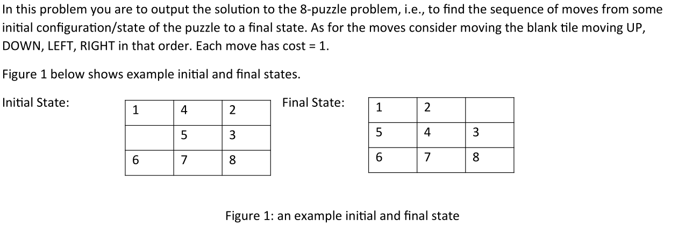
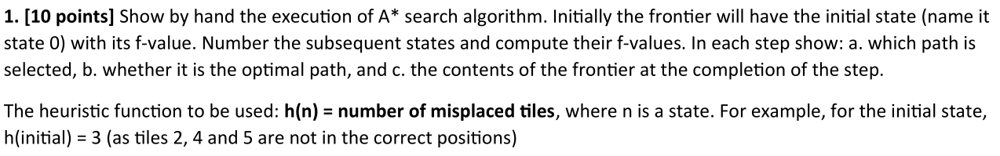
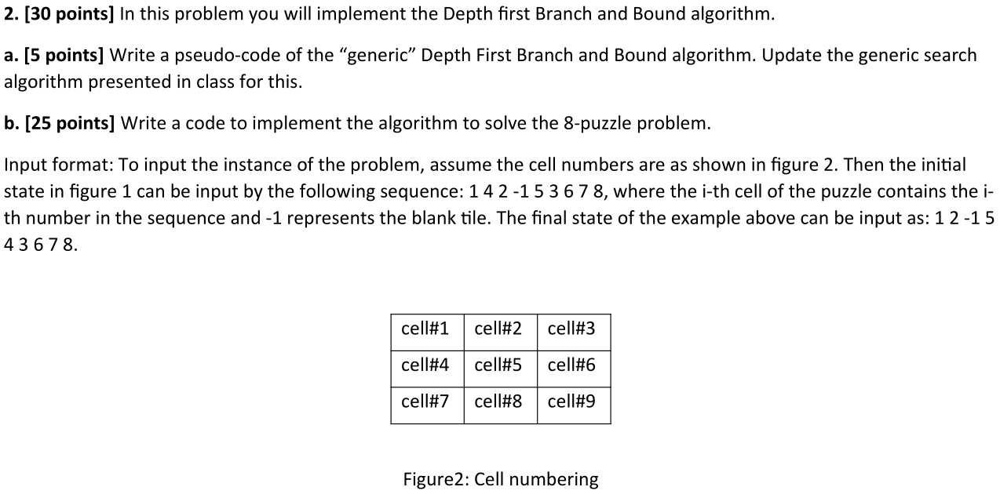

# CSC425 Assignment 3
## Mir Shafayat Ahmed 1910456



# Question 1



Order : L -> U -> R -> D

|\||     | Goal|     |\||
|--|:---:|:---:|:---:|--|
|\||  1  |  2  |  _  |\||
|\||  5  |  4  |  3  |\||
|\||  6  |  7  |  8  |\||

|\||S0   |f=0+3| Initial|\||
|--|:---:|:---:|:---:|--|
|\||  1  |  4  |  2  |\||
|\||  _  |  5  |  3  |\||
|\||  6  |  7  |  8  |\||


```python
Frontier:
    S0 : 0+3 = 3
```


|\||S1   |f=1+4|  U  |\||S2   |f=1+2|  R  |\||S3   |f=1+4|  D  |\||
|--|:---:|:---:|:---:|--|:---:|:---:|:---:|--|:---:|:---:|:---:|--|
|\||  _  |  4  |  2  |\||  1  |  4  |  2  |\||  1  |  4  |  2  |\||
|\||  1  |  5  |  3  |\||  5  |  _  |  3  |\||  6  |  5  |  3  |\||
|\||  6  |  7  |  8  |\||  6  |  7  |  8  |\||  _  |  7  |  8  |\||

```python
Frontier:
    S0 -> S2 : 1+2 = 3
    S0 -> S1 : 1+3 = 4
    S0 -> S3 : 1+3 = 4
```

|\||S1   |f=1+4|  U  |\||S21  |f=2+1|  U  |\||S22  |f=2+3|  R  |\||S23  |f=2+3|  D  |\||S3   |f=1+4|  D  |\||
|--|:---:|:---:|:---:|--|:---:|:---:|:---:|--|:---:|:---:|:---:|--|:---:|:---:|:---:|--|:---:|:---:|:---:|--|
|\||  _  |  4  |  2  |\||  1  |  _  |  2  |\||  1  |  4  |  2  |\||  1  |  4  |  2  |\||  1  |  4  |  2  |\||
|\||  1  |  5  |  3  |\||  5  |  4  |  3  |\||  5  |  3  |  _  |\||  5  |  7  |  3  |\||  6  |  5  |  3  |\||
|\||  6  |  7  |  8  |\||  6  |  7  |  8  |\||  6  |  7  |  8  |\||  6  |  _  |  8  |\||  _  |  7  |  8  |\||

```python
Frontier:
    S0 -> S2 -> S21 : 2+1 = 3
    S0 -> S1 : 1+3 = 4
    S0 -> S3 : 1+3 = 4
    S0 -> S2 -> S22 : 2+3 = 5
    S0 -> S2 -> S23 : 2+3 = 5
```

|\||S1   |f=1+4|  U  |\||S22  |f=2+3|  R  |\||S23  |f=2+3|  D  |\||S3   |f=1+4|  D  |\||
|--|:---:|:---:|:---:|--|:---:|:---:|:---:|--|:---:|:---:|:---:|--|:---:|:---:|:---:|--|
|\||  _  |  4  |  2  |\||  1  |  4  |  2  |\||  1  |  4  |  2  |\||  1  |  4  |  2  |\||
|\||  1  |  5  |  3  |\||  5  |  3  |  _  |\||  5  |  7  |  3  |\||  6  |  5  |  3  |\||
|\||  6  |  7  |  8  |\||  6  |  7  |  8  |\||  6  |  _  |  8  |\||  _  |  7  |  8  |\||

|\||S211 |f=3+2|  L  |\||S212 |f=3+0|  R  |\||
|--|:---:|:---:|:---:|--|:---:|:---:|:---:|--|
|\||  _  |  1  |  2  |\||  1  |  2  |  _  |\||
|\||  5  |  4  |  3  |\||  5  |  4  |  3  |\||
|\||  6  |  7  |  8  |\||  6  |  7  |  8  |\||

```python
Frontier:
    S0 -> S2 -> S21 -> S212 : 3+0 = 3 #Goal found. Therefore Search Stopped.
    S0 -> S1 : 1+3 = 4
    S0 -> S3 : 1+3 = 4
    S0 -> S2 -> S21 -> S211 : 3+2 = 5
    S0 -> S2 -> S22 : 2+3 = 5
    S0 -> S2 -> S23 : 2+3 = 5
```

# Question 2



```
create a stack
push start node into stack
find children of start node
calculate f-value for each child
push the children of the start node such that lowest 
```
